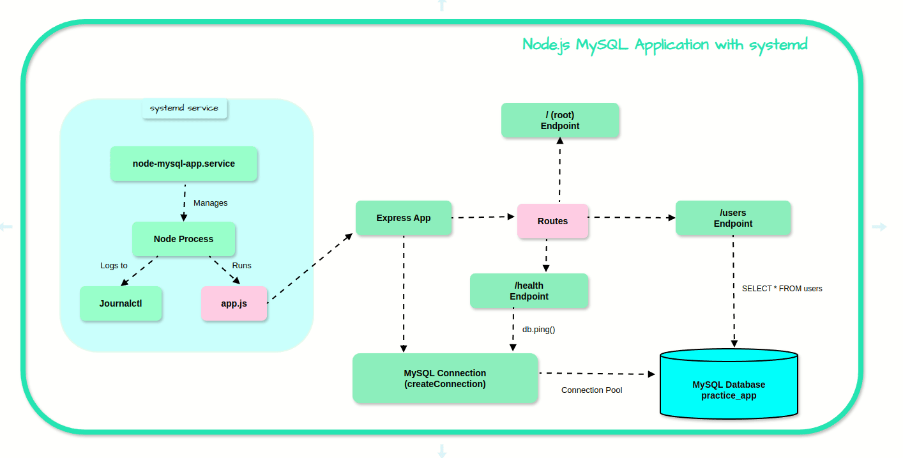

# Node.js MySQL Application with systemd


A production-ready Node.js application with MySQL database integration, deployed as a systemd service.


## Features
- REST API with Express.js
- MySQL database integration
- systemd service management
- Automatic restart on failure
- Health check endpoint
- User management API

## Prerequisites
- Node.js 
- MySQL 
- Linux with systemd

## Installation

### 1. Clone the repository
```bash[
https://github.com/educationfor3530/node-mysql-systemd.git
cd node-mysql-app
```

### 2. Install dependencies
```bash
npm init -y
npm install express mysql2
```
### 3. MySQL install
```bash
sudo apt update
sudo apt install mysql-server
sudo mysql -u root -p
```
### 4. Database Setup
```sql
CREATE DATABASE practice_app;
CREATE USER 'app_user'@'localhost' IDENTIFIED BY 'secure_password';
GRANT ALL PRIVILEGES ON practice_app.* TO 'app_user'@'localhost';
FLUSH PRIVILEGES;

USE practice_app;

CREATE TABLE users (
  id INT AUTO_INCREMENT PRIMARY KEY,
  name VARCHAR(100) NOT NULL,
  email VARCHAR(100) NOT NULL UNIQUE
);

INSERT INTO users (name, email) VALUES 
('Alice Johnson', 'alice@example.com'),
('Bob Smith', 'bob@example.com'),
('Charlie Brown', 'charlie@example.com');
```

### 5. Secure MySQL installation
```bash
sudo mysql_secure_installation
```

## Deployment as systemd Service

1. Create a dedicated system user:
```bash
sudo useradd -r -s /bin/false appuser
```
2. Set up application directory with proper permissions:
```bash
sudo mkdir -p /opt/node-mysql-app
sudo cp -R . /opt/node-mysql-app
sudo chown -R appuser:appuser /opt/node-mysql-app
```
3. Create a systemd service file:
```bash
sudo vi /etc/systemd/system/node-mysql-app.service
```

4. Paste this configuration:
```ini
[Unit]
Description=Node.js MySQL Application
After=network.target mysql.service

[Service]
User=appuser
Group=appuser
WorkingDirectory=/opt/node-mysql-app
ExecStart=/usr/bin/node /opt/node-mysql-app/app.js
Restart=always
RestartSec=10
Environment=NODE_ENV=production
EnvironmentFile=/opt/node-mysql-app/.env

[Install]
WantedBy=multi-user.target
```

5. Enable and start the service:
```bash
sudo systemctl daemon-reload
sudo systemctl enable node-mysql-app
sudo systemctl start node-mysql-app
```

## API Endpoints
- `GET /` - Application info
- `GET /health` - Health check
- `GET /users` - List all users

## Monitoring
Check service status:
```bash
sudo systemctl status node-mysql-app
```

View logs:
```bash
journalctl -u node-mysql-app -f
```
